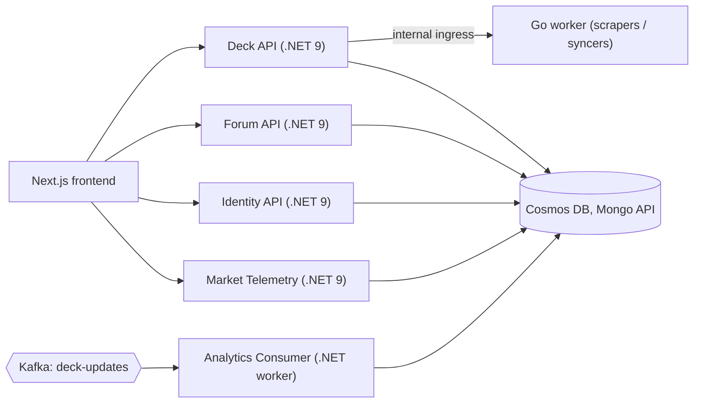

# ErreGeTe YGO

A full-stack Yu-Gi-Oh! deck building and card tracking platform, live at **[erregeteygo.com](https://erregeteygo.com)**.

Build and share decks, browse the competitive meta, track your card collection in a virtual binder, watch card prices, and check the Master Duel, TCG and OCG forbidden & limited lists, all in one place.

<!-- Add a screenshot or two here, e.g.  -->

## Features

- **Deck builder**: main / extra / side decks with rule checks, `.ydk` import and export.
- **Card search**: search the full card pool and add cards to your collection straight from the results.
- **Meta decks**: browse top competitive lists with card inspector, price breakdown and one-click "open in builder".
- **Collection tracker**: record the copies you own and see them in a 3D page-turning **binder** (holographic card tilt) or a simple grid. Browse by set and see how complete each one is.
- **"What do I need?" panel**: on any meta deck or saved deck, see owned vs. needed copies per card, the missing cards, and the estimated cost to finish the deck.
- **Ban lists**: Master Duel, TCG and OCG, kept up to date by an automatic background sync.
- **Market watch**: card prices ingested from public price data and shown with trends.
- **Pack simulator**, **card creator**, **news**, and a **community forum** with general and competitive discussion.
- **AI helpers**: card suggestions, combo playbooks and deck write-ups.

## Architecture



| Folder | What it is |
| --- | --- |
| `YuGiOh_Deck_React` | Next.js (App Router) + React 19 frontend: Redux Toolkit, TanStack Query, React-Bootstrap, SignalR, Recharts |
| `YuGiOh_Deck_API` | Main .NET 9 API: decks, meta decks, collection, ban lists, Master Duel sync. Includes the Go worker in `go-services` |
| `YuGiOh_Forum_API` | .NET 9 API for the forum and discussions |
| `YuGiOhIdentityApi` | .NET 9 API for registration, login and password reset (JWT) |
| `MarketTelemetry.Service` | .NET 9 API plus a background worker that ingests card prices on a schedule |
| `YuGiOh_Analytics_Consumer` | .NET worker that consumes deck-update events from Kafka, with a dead-letter container in Azure Blob Storage |
| `YuGiOh_Deck_API.Tests` | xUnit + Moq tests for the Deck API |

### Design notes

- **Auth**: JWT bearer tokens; owner-scoped routes, so you can only change your own decks and collection.
- **Collection model**: one row per (user, card). Setting a quantity is an idempotent `PUT`, and the UI updates optimistically and rolls back on failure.
- **Master Duel ban list**: a hosted background service asks the Go worker to scrape on a schedule, with retries. A scrape that looks incomplete is rejected instead of overwriting good data, and saves insert the new data before deleting the old.
- **Frontend state**: small external stores read with `useSyncExternalStore` (card hover focus, collection), so hovering a card doesn't re-render a whole page.

## Tech stack

**Frontend:** Next.js 16, React 19, Redux Toolkit, TanStack Query, Bootstrap 5, Vitest
**Backend:** .NET 9 / ASP.NET Core, Go, MongoDB driver, Kafka (Confluent.Kafka)
**Data:** Azure Cosmos DB (Mongo API), Azure Blob Storage (card images, dead letters)
**Infra:** Docker, Azure Container Registry, Azure Container Apps, GitHub Actions

## Running it locally

Prerequisites: Node.js 20+, the .NET 9 SDK, and (optionally) Go for the worker.

```bash
# Frontend
cd YuGiOh_Deck_React
npm install --legacy-peer-deps
npm run dev          # http://localhost:3000
npm test             # Vitest unit tests

# Backend tests
dotnet test YuGiOh_Deck_API.Tests
```

The frontend reads the API address from `NEXT_PUBLIC_API_URL` (it falls back to the hosted API). Each .NET service needs its own settings, such as the database connection string and `Jwt__Key`, `Jwt__Issuer` and `Jwt__Audience`. Supply them with [user secrets](https://learn.microsoft.com/aspnet/core/security/app-secrets) or environment variables. **Never commit secrets.**

## Deployment

Every push runs a GitHub Actions pipeline (`.github/workflows/deploy.yml`):

1. Secret scan
2. .NET build and tests, Go vet / build / tests, frontend tests and build
3. Build and push Docker images to Azure Container Registry
4. Deploy to Azure Container Apps. The Deck API uses a **blue/green revision**: the new revision is smoke-tested against `/health` before traffic is moved, and traffic rolls back automatically if the check fails.
5. Check the live site

## Roadmap

- Hand simulator and opening-hand probability calculator
- Ban list change alerts
- Collection "briefcase" showcase view

## Disclaimer

ErreGeTe YGO is an unofficial fan project and is not affiliated with or endorsed by Konami. Yu-Gi-Oh! and all related names and images are trademarks of their respective owners. Card data comes from [YGOPRODeck](https://ygoprodeck.com).
